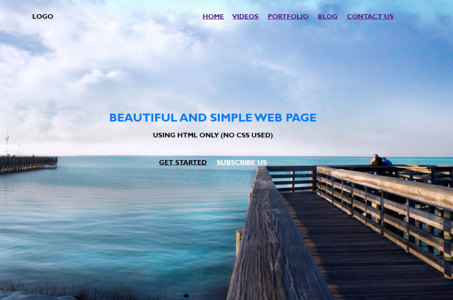

# HTML + CSS simple page

## 1 etapas

### Ką sukursime?

### Ką naudosime?

-   HTML tag:
    -   ` `
    -   `<nav></nav>`
    -   `<h1></h1>`
    -   `<h2></h2>`
    -   `<h3></h3>`
    -   ``
-   HTML tag's attributes:
    -   style="":
        -   background-image, background-repeat; background-size
        -   text-align
        -   color
        -   font-family
-   HTML Entities:
    -   `&nbsp;`
